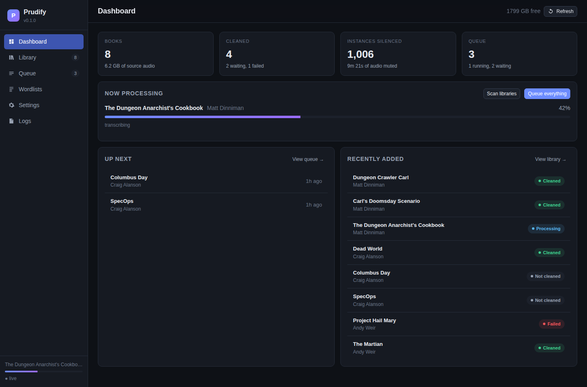
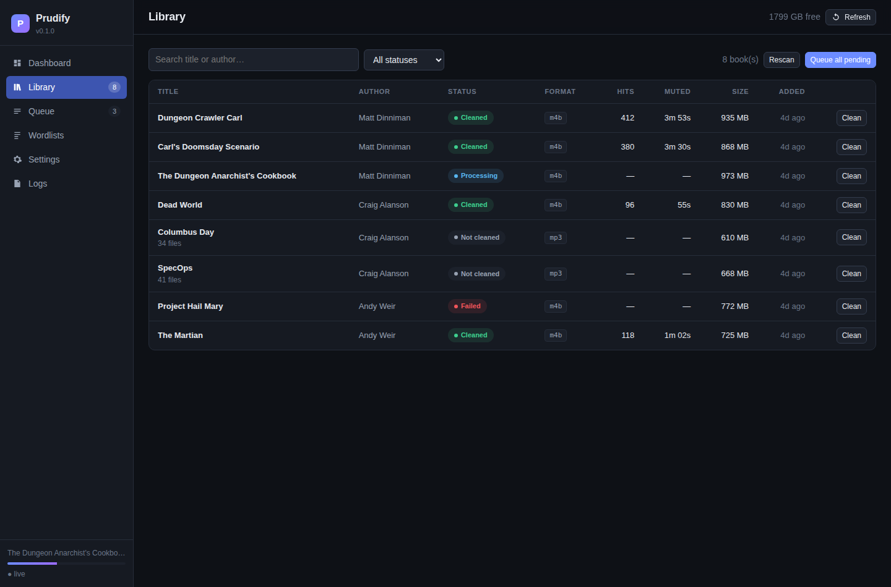
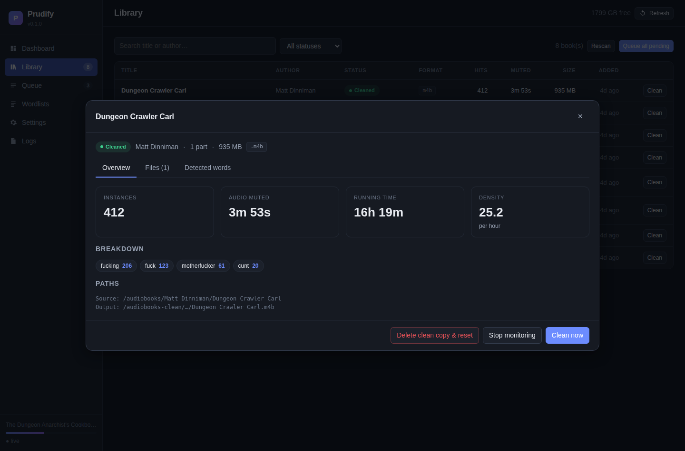
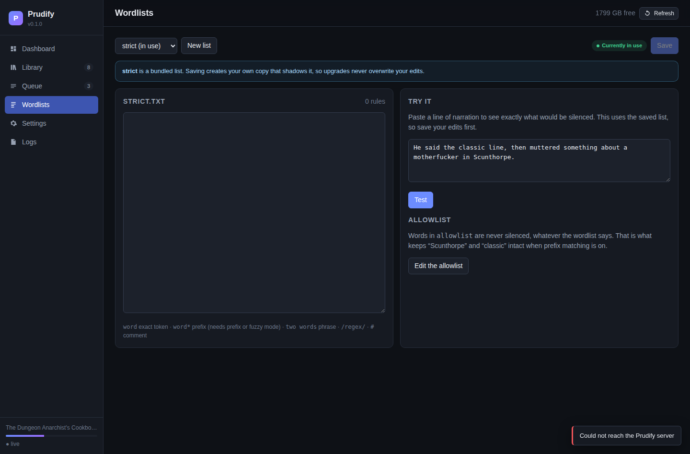
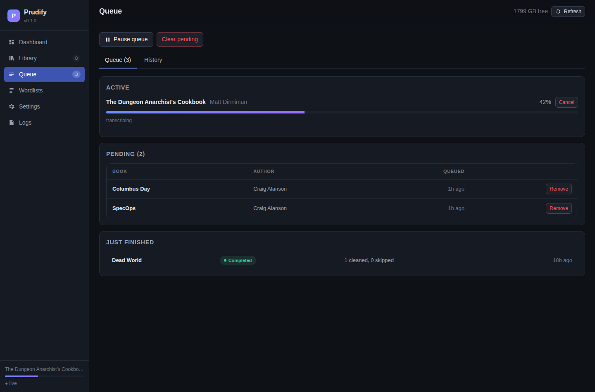

<div align="center">

# Prudify

**Profanity filtering for audiobook libraries, with a web UI.**

Watches your library, transcribes new books with Whisper, and writes a cleaned
copy to a second folder — chapters, cover art, tags and running time intact.
Your originals are never touched.

[Install](#install) · [How it works](#how-it-works) · [Configuration](docs/configuration.md) · [Wordlists](docs/wordlists.md) · [FAQ](#faq)

</div>

---

## Why

Audiobookshelf, Plex and Jellyfin will happily serve a library. None of them
will hand you a version of *Dungeon Crawler Carl* you can play in the car with
a seven-year-old in the back seat.

Doing it by hand works but does not scale: transcribe a 20-hour M4B, find every
instance, mute each one, remux without losing the chapter markers or the cover,
check the duration still matches, repeat 400 times. Prudify is that loop, run
as a service — a watched folder, a queue, and a web UI, so the work happens
without you thinking about it.

*prudify*, verb: to make prudish. It is a real word, and it is the only one
that describes this honestly.

## What it does

- **Watches** one or more library folders and picks up new books automatically.
- **Detects** the format per file — M4B, M4A, MP3, MP4, FLAC, OGG, Opus, WAV, WMA.
- **Transcribes** with word-level timestamps via `faster-whisper`, chunking long
  books automatically so memory use and cancellation stay bounded.
- **Matches** against editable wordlists, with an allowlist that keeps
  Scunthorpe out of trouble.
- **Silences** each hit (or beeps over it, or cuts it) with configurable padding.
- **Preserves** chapters, embedded cover art, and all metadata, then validates
  the result against the source before publishing it.
- **Mirrors** your folder structure into a clean library you can point a second
  Audiobookshelf library at.
- **Handles podcasts too.** Set a library's layout to *Episodes* and each file
  is treated as its own item rather than one part of a single enormous work,
  so a show with hundreds of episodes cleans and fails one episode at a time.
- **Browse by author**, with a count of what is cleaned and what is waiting,
  and a *Clean all* button per author. Most libraries divide into writers you
  want filtered and writers you do not; that is the decision, not book by book.
- **Shows the cover art** already embedded in your files, extracted on demand
  and cached, in the library, on the dashboard and beside the running job.
- **Says what it is doing.** Each job reports its stage, how long that stage
  has been running and an estimate for it, so a long encode is legibly slow
  rather than apparently stuck.
- **Survives being stopped.** A container killed mid-render leaves its job
  requeued rather than failed, resumes from the cached transcript, and its
  scratch files are collected on the next start.
- **Never writes to your source files.** Mount them read-only if you want the
  guarantee enforced rather than promised.



<div align="center">

| | |
| --- | --- |
|  |  |
| **Library** — sortable, searchable, per-book status | **Book detail** — every instance on a timeline |
|  |  |
| **Wordlists** — edit and test before you commit | **Queue** — pause, reorder, cancel, review history |

</div>

> The screenshots above use sample data, and predate the cover art, the
> Authors page and the per-stage timings on the dashboard.

## Install

### Docker (recommended)

The image is published to Docker Hub as **`camwise/prudify`** and to GitHub
Container Registry as **`ghcr.io/camwise1/prudify`**. They are the same build;
Docker Hub needs no login, so the examples use it. Both carry `linux/amd64`
and `linux/arm64`, so Apple Silicon and a Raspberry Pi work as-is.

```yaml
# docker-compose.yml
services:
  prudify:
    image: camwise/prudify:latest
    container_name: prudify
    restart: unless-stopped
    ports:
      - "8317:8317"
    environment:
      TZ: America/Denver
      PRUDIFY_WORK_DIR: /work     # keep multi-GB scratch off the config mount
    volumes:
      - ./config:/config
      - work:/work
      - /path/to/audiobooks:/audiobooks:ro
      - /path/to/audiobooks-clean:/audiobooks-clean
    logging:                      # or the container log grows without bound
      driver: json-file
      options:
        max-size: "10m"
        max-file: "3"

volumes:
  work:
```

```bash
docker compose up -d
```

Open <http://localhost:8317> and create your account — the first visit sets the
username and password. Then add a library pointing at `/audiobooks` →
`/audiobooks-clean`.

**The output path must be on a writable mount.** Pointing it inside a `:ro`
media mount is the most common setup mistake; Prudify now refuses it when you
save the library rather than failing after transcription.

### Native (macOS, Windows, Linux)

Requires Python 3.10+ and `ffmpeg` on your `PATH`.

```bash
pip install "prudify[whisper]"
prudify add-library /path/to/audiobooks /path/to/audiobooks-clean
prudify serve
```

`ffmpeg` comes from `brew install ffmpeg`, `winget install Gyan.FFmpeg`, or
your distribution's package manager. See [docs/install.md](docs/install.md) for
running it as a service on each platform.

### From source

```bash
git clone https://github.com/Camwise1/prudify.git prudify && cd prudify
pip install -e ".[whisper,dev]"
cd frontend && npm install && npm run build && cd ..
prudify serve
```

## How it works

```
   watcher ──► scanner ──► queue ──► ┌─────────── pipeline ───────────┐
  (inotify +   (folders    (SQLite,  │ probe → transcribe → match →   │
   rescan)      → books)   resumable)│ render → validate → publish    │
                                     └────────────────────────────────┘
```

A **book** is any folder that directly contains audio files. One file or forty,
M4B or a pile of MP3s — each file is cleaned independently and lands in the
mirrored position under your output folder.

**Transcription** produces a flat list of words, each with a start time, an end
time and a confidence. Transcripts are cached on disk keyed by file identity
*and* model, so re-running a book with a different wordlist is nearly instant —
you pay for Whisper once per book per model.

**Matching** is whole-token and case-insensitive by default. An allowlist is
consulted before any rule. Multi-word rules such as `mother fucker` claim their
tokens before single-word rules get a look, so you get one interval, not two.

**Rendering** is a single ffmpeg pass from the original file, which is what
lets `-map_metadata` and `-map_chapters` copy tags, chapters and cover art
straight across. Mute intervals become batched `volume=0:enable=...` filters
written to a script file — a book with a thousand hits produces a filter graph
well past the Windows command-line limit, and a script file sidesteps that on
every platform.

**Validation** compares the output against the source — duration within
tolerance, chapter count unchanged, cover art still present — and deletes the
output rather than publishing a broken file into your clean library.

## Modes

| Mode | What happens | Duration | Use when |
| --- | --- | --- | --- |
| `mute` *(default)* | Audio drops to silence over the word | Unchanged | You want a clean listen with no artefacts |
| `beep` | A tone plays over the word | Unchanged | You want to know something was removed |
| `cut` | The audio is removed and the gap closed | Shorter | You want no trace at all |

`cut` rebuilds chapter markers to match the new timeline, but playback progress
saved against the original will no longer line up. `mute` is the safe default.

## Performance

Whisper dominates the runtime. Prudify sizes its own transcription threads
from the cores it can see -- honouring a container CPU limit, which
`os.cpu_count()` does not -- so there is normally nothing to tune. Rough
figures for a 15-hour audiobook on CPU:

| Model | RAM | Approx. time (4 cores) | Notes |
| --- | --- | --- | --- |
| `tiny.en` | ~0.4 GB | ~1 h | Misses words; not recommended |
| `base.en` | ~0.7 GB | ~2 h | Good default for profanity detection |
| `small.en` | ~1.5 GB | ~6 h | Noticeably better on mumbled dialogue |
| `medium.en` | ~3.5 GB | ~18 h | Diminishing returns for this job |

`faster-whisper` with `int8` on CPU uses roughly half the memory of
`openai-whisper` and decodes several times faster. Prudify transcribes short
files whole and automatically chunks long books, so cancelling or restarting
does not have to wait on a many-hour decode. Settings → Transcription →
*Chunk length* can force a specific segment size with overlap handling and
per-chunk resume.

An NVIDIA GPU changes the picture entirely: `base.en` on CUDA is roughly
real-time × 40.

## Recipes

**Only the two strongest words.** Wordlists → `strict`, match mode `exact`.
That is the shipped default: F-word and C-word variants, nothing else.

**Catch mishearings too.** Match mode `fuzzy` tolerates one character of edit
distance on words of four letters or more. Check the allowlist afterwards.

**Preview before committing.** Settings → Processing → *Dry run*. Books are
transcribed and matches recorded, but nothing is written. Open a book to see
exactly what would be cut, then turn dry run off — the cached transcripts mean
the real run skips straight to rendering.

**One book, from the terminal.**

```bash
prudify clean "/audiobooks/Craig Alanson/Dead World/Dead World.m4b" \
  --wordlist strict --model base.en --dry-run
```

**Check a sentence against your list.**

```bash
prudify test-words "a classic assessment in Scunthorpe"
```

## FAQ

**Does it modify my originals?**
No. Prudify only ever reads from the source path and writes to the output
path. Mount the source read-only if you want that enforced by the kernel.

**What if a book has nothing to silence?**
It is copied across unchanged so the clean library stays a complete mirror.
Turn off *Copy clean books across unchanged* if you would rather it be sparse.

**Will it work over SMB or NFS?**
Yes. Filesystem events often do not propagate over network shares, so Prudify
also rescans on a schedule (hourly by default) — that is usually the mechanism
that actually fires. Set `PRUDIFY_POLLING_WATCHER=1` to force polling.

**Can I run it alongside Audiobookshelf?**
That is the intended setup. Point one Audiobookshelf library at your source
folder and a second at the clean folder.

**Why does the percentage sit still for so long?**
Because one stage really is that long. Encoding a 20 hour book is a single
ffmpeg run, and publishing the result to a network share is a multi-gigabyte
copy. The queue reports how long the current stage has been running and an
estimate for it, so a number that has not moved still tells you it is alive.
If the elapsed time stops climbing too, that is a genuine hang — check Logs.

**Why is my book stuck at "transcribing"?**
The first run downloads the Whisper model. After that, check Logs — the usual
culprits are a missing model cache volume or too few threads.

**Does it handle non-English audiobooks?**
Transcription does, via the language setting. The bundled wordlists are English
only; add your own on the Wordlists page.

## Project layout

```
backend/prudify/
  core/        probe, transcribe, match, render — no server dependencies
  services/    queue, watcher, event bus, library reconciliation
  api/         FastAPI routers
  wordlists/   bundled lists
frontend/      React + Vite UI (built into backend/prudify/static)
tests/         pytest suite
```

`core/` has no knowledge of the database or the web server, which is what makes
`prudify clean` and the queue two thin wrappers over the same code.

## Contributing

Issues and pull requests welcome — see [CONTRIBUTING.md](CONTRIBUTING.md).
The bundled wordlists are deliberately conservative; if you maintain a better
one, a PR adding it under `backend/prudify/wordlists/` is a good contribution.

## Prior art

[monkeyplug](https://github.com/mmguero/monkeyplug) does the single-file
version of this well and was the starting point for a lot of the thinking here.
Prudify exists because a library needs a queue, a UI, resume, and format
coverage that a one-shot CLI is not trying to provide.

## License

MIT. See [LICENSE](LICENSE).

The container image also ships other people's software. Everything Prudify
depends on is MIT, BSD-3-Clause or Apache-2.0, with one thing worth knowing:
Debian builds FFmpeg with `--enable-gpl`, so the image carries a GPL binary.
That does not reach Prudify's own licence — FFmpeg runs as a separate process
rather than being linked — but it does put a source-offer obligation on anyone
redistributing the image. The details are in
[THIRD-PARTY-NOTICES.md](THIRD-PARTY-NOTICES.md).
